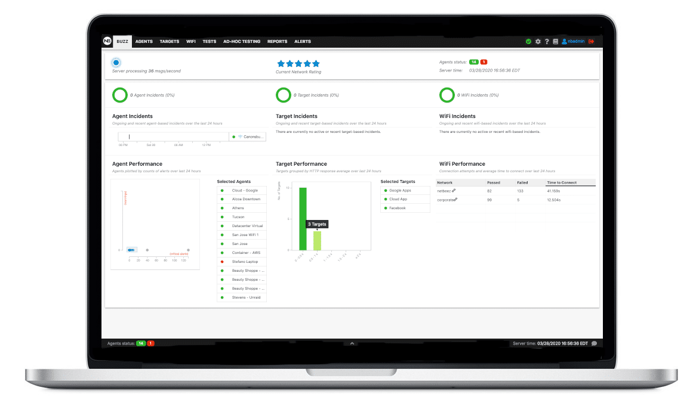
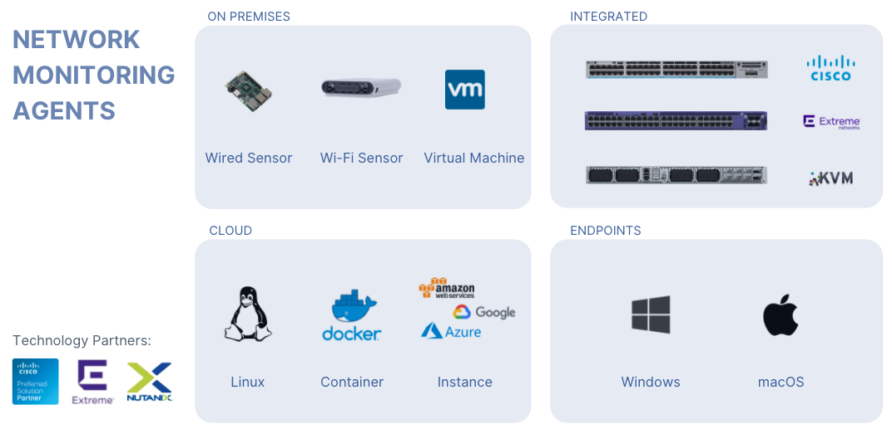
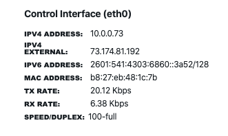
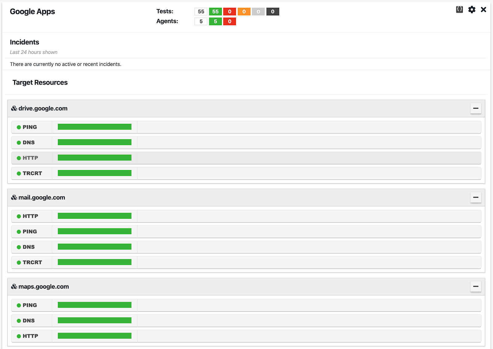
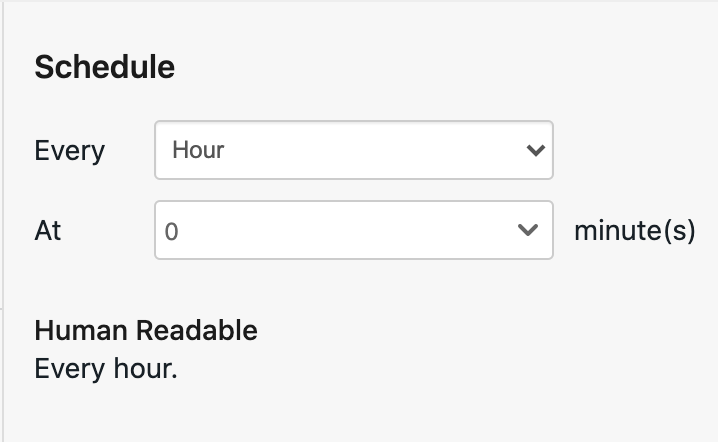

# Overview
**NetBeez** is a distributed network monitoring platform. The monitoring is performed from multiple points via hardware, software, and cloud agents, called *Beez*.  The agents are managed by a server, called the *Beezkeeper*, which is also located on-premise or in the cloud. 

- [Dashboard](#dashboard)
- [Server (BeezKeeper)](#server-beezkeeper)
- [Agents](#agents)
	- [Control channel](#control-channel)
	- [Agent Categories](#agent-categories)
		- [Network Agents - Physical appliances](#network-agents---physical-appliances)
			- [Wired (GigE) - 10/100/1000Mbps](#wired-gige---101001000mbps)
			- [Wireless (WiFi) - 802.11ac](#wireless-wifi---80211ac)
		- [Network Agents - Software-based](#network-agents---software-based)
			- [Virtual agent](#virtual-agent)
			- [Linux agent](#linux-agent)
			- [Docker Agent](#docker-agent)
		- [Remote Worker Agents](#remote-worker-agents)
			- [Windows Agent](#windows-agent)
			- [Mac OS Agent](#mac-os-agent)
- [Targets](#targets)
- [Scheduled tests](#scheduled-tests)

## Dashboard
The dashboard is the graphical user interface that is necessary to manage the agents, create monitoring tests, troubleshoot network or application problems, and receive alerts and reports.  The Dashboard runs on a dedicated server, called BeezKeeper. 

## Server (BeezKeeper)
The NetBeez server is the main component of the solution. The BeezKeeper is responsible for managing the agents, storing the data received by the agents, generating alerts, incidents, and notifications. The BeezKeeper can be hosted on premises as a virtual appliance or in the cloud, managed by either NetBeez (AWS) or by the customer itself (AWS, Azure, etc.). The amount of CPU, RAM, and disk space required to run the server varies depending on the number of agents managed and the number of tests running. Please consult the online documentation for more details on [server requirements](https://netbeez.zendesk.com/hc/en-us/articles/360031332291).
## Agents
The agents (also called *Beez*) serve as the monitoring endpoints that run tests on the network and against the applications or targets. We have three types of agents: wired, wireless, and virtual/software. You can review the installation instructions on [this documentation page](https://netbeez.zendesk.com/hc/en-us/articles/204333545-Agent-Types). 

### Control channel

The agents are centrally managed through the dashboard to which they send real-time results. This is established via a TCP connection from the agents to the dashboard. By default, the control channel is an encrypted SSL socket to TCP port 20018 on the server. 

The connection is initiated by the agents, simplifying the deployment of agents behind a NAT or a firewall. For this reason, each agent’s interface can display up to three addresses:

- IPv4 address: This is the address associated with the Ethernet or WiFi interface.
- IPv4 external: This is the public IPv4 address, available if the agent is behind NAT.
- IPv6 address: This is the IPv6 address associated with the Ethernet interface.

### Agent Categories

NetBeez Agents are divided into two categories, Network Agents and Remote Worker Agents.

- Network Agents: Hardware sensors (GigE, Wi-Fi), virtual machines, Docker containers, cloud instances (AWS), and Linux packages for monitoring on-prem, cloud, and remote environments.
- Remote Worker Agents: Native applications for Windows and macOS systems installed on end-user desktops and laptops for monitoring work-from-home or remote users.
#### Network Agents - Physical appliances

Hardware agents are convenient for plug-and-play deployments without software installation. Agents come pre-configured by NetBeez before being shipped to the user. All that is required is an Ethernet switch port.

Agents are powered either by PoE (Power over Ethernet) or by an external PSU (Power Supply Unit). A hardware agent can monitor via the Ethernet or the WiFi interface, based on the model selected. There are two models of hardware agents:
##### Wired (GigE) - 10/100/1000Mbps

The wired agent simulates an Ethernet client and can run throughput tests up to 1 Gbps. This agent cannot do WiFi testing.

##### Wireless (WiFi) - 802.11ac

The wireless agent simulates a WiFi client with an 802.11ac interface and can run throughput tests up to 150 Mbps. The control channel is established via an Ethernet connection. If available, otherwise via the WiFi interface.

*A NetBeez WiFi sensor.*

#### Network Agents - Software-based
Software agents can be deployed as a virtual appliance, a Docker container, a Linux package for Debian and Ubuntu systems, or a cloud image for AWS (for Azure and other cloud providers, we recommend using the Linux package).
##### Virtual agent
A virtual agent is deployed at data centers or on any equipment that supports virtualization. NetBeez supports VMware, Microsoft HyperV, KVM, and vBox hypervisors. A virtual agent at the datacenter is used, for example, to measure connectivity and throughput from remote WAN locations. Virtual agents are also deployed at remote sites, hosted on networking hardware for example. 

##### Linux agent
The Linux agent is installed via the apt-get command on distributions such as Debian, Ubuntu, and Raspbyan. The Linux agent is convenient to enable NetBeez network monitoring on an existing Linux host, such as a server, workstation, or single-board computers such as Raspberry Pi and Odroid.

##### Docker Agent
The Docker agent is available via the [NetBeez Docker hub page](https://hub.docker.com/r/netbeez/nb-agent). A NetBeez Docker agent is installed on a server, on an end-user desktop, or networking hardware (e.g. Cisco Catalyst Series switches with AppHosting). When deployed on a Mac OS or Windows 10 Professional or Enterprise system, it monitors the network performance of remote workers.

#### Remote Worker Agents

Remote Worker Agents are designed to support employees who are working from home. These agents support:

- Real-time tests: ping, TCP ping, DNS, HTTP/S, Traceroute, Path Analysis.
    
- Scheduled tests: VoIP, Iperf, and Internet speed.
    
- Up to 20 real-time tests and 3 scheduled tests.
    
- Wi-Fi metrics for WLAN monitoring.
    

The remote worker agents can be installed on Windows and Mac.

##### Windows Agent

The Windows Remote Worker agent is an executable program that runs on Windows Desktops and Laptops. Currently, both Windows 7 and 10 versions are supported. You can download the latest version of the executable (in MSI format) [here](https://github.com/netbeez/windows/releases/latest).

##### Mac OS Agent

## Targets
A target is a web application or TCP-based service that is monitored by one or more agents running real-time tests such as ping, DNS, HTTP, traceroute and path analysis. A target is defined by one or more resources, which are defined by IP address, Fully Qualified Domain Name (FQDN), or URL. Each resource has its own assigned tests and alert profiles. We’ll talk more about targets in the [Monitoring](https://docs.google.com/document/d/1GsIWkWI3mMj2xqG0Ce_1BNrb8t8RhePK_bokT24sjo4/edit#heading=h.f8ca4ozijm9s) section of this tutorial.

## Scheduled tests

NetBeez supports three categories of scheduled tests: Iperf, speed test, and VoIP. Different from a real-time test, which is defined by a testing interval, a scheduled test runs less frequently according to a schedule defined by the user.

We’ll talk more about scheduled tests in the [Monitoring](https://docs.google.com/document/d/1GsIWkWI3mMj2xqG0Ce_1BNrb8t8RhePK_bokT24sjo4/edit#heading=h.f8ca4ozijm9s) section of this tutorial.